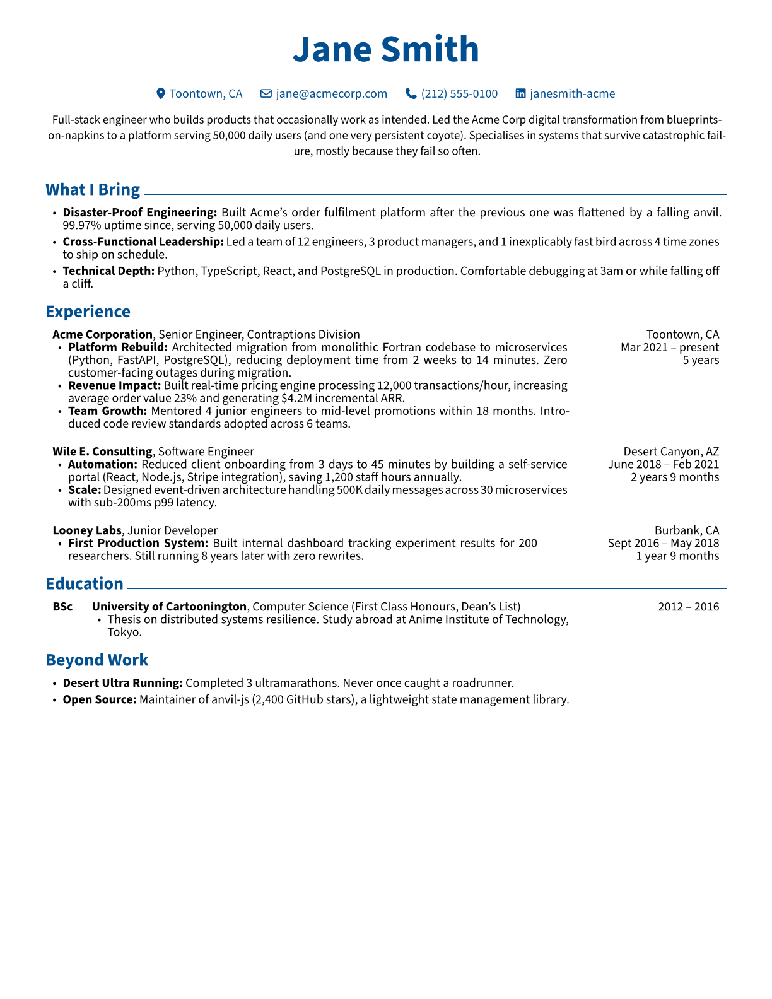
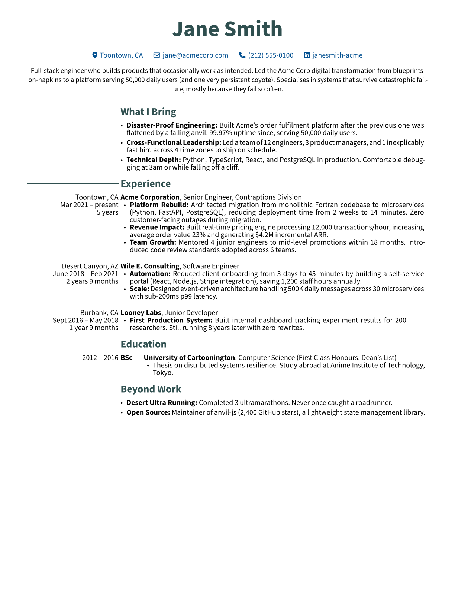
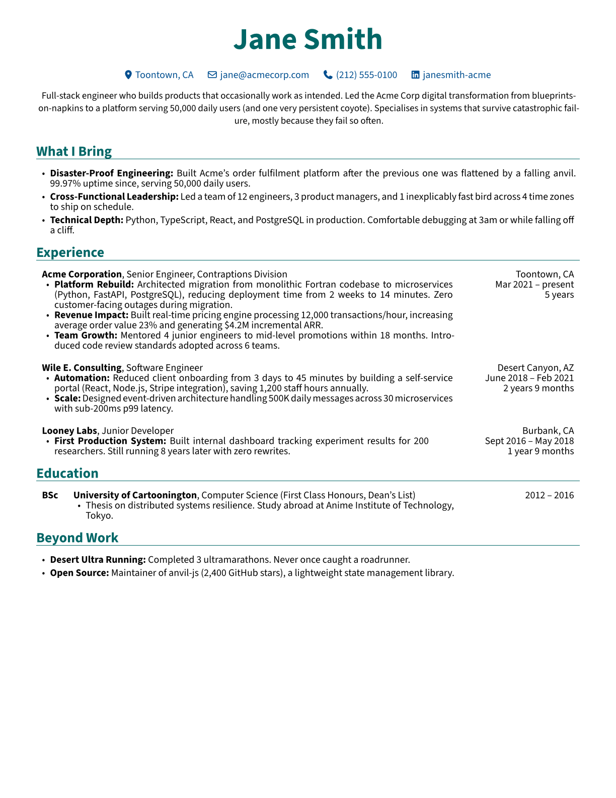
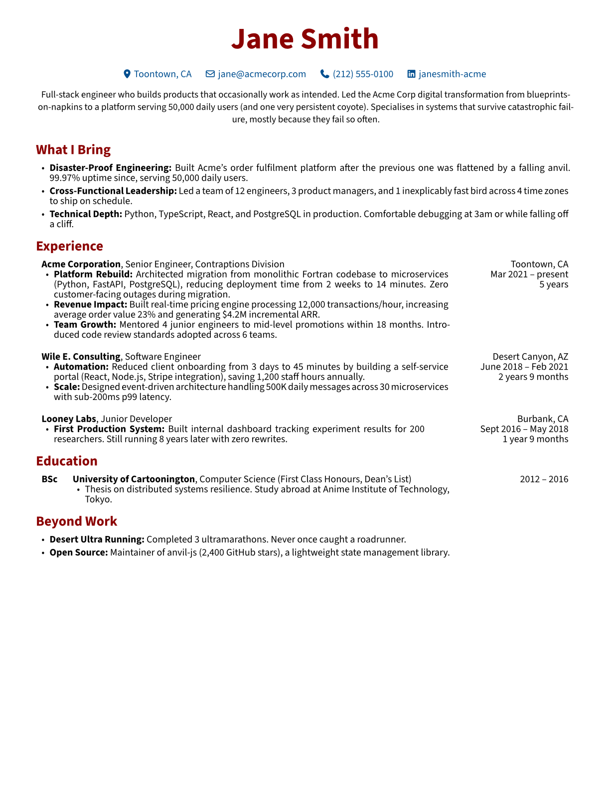
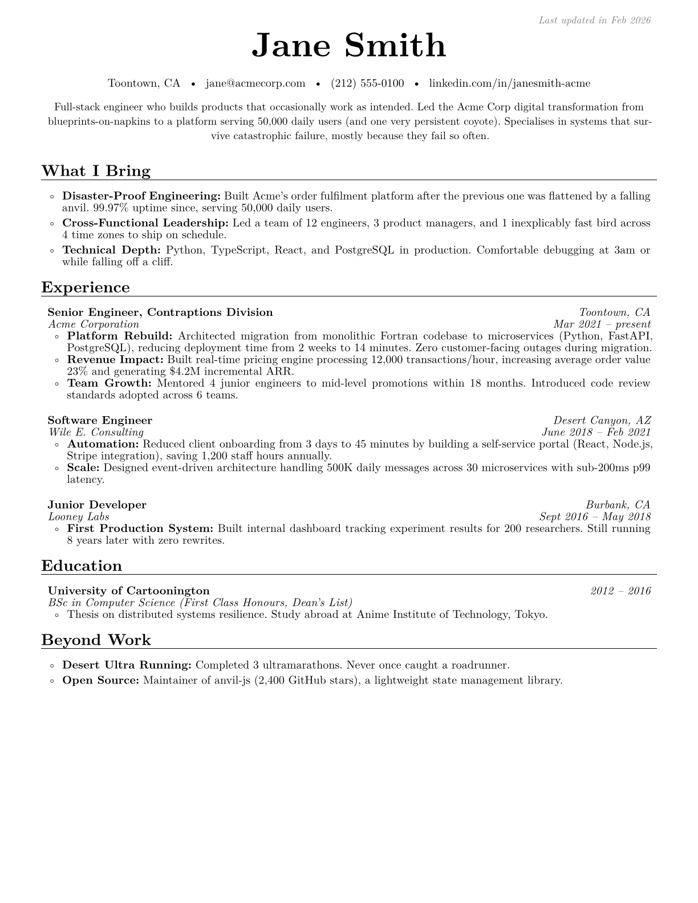

# Resume Builder for Engineers

**Resume creator built on [Claude Code](https://docs.anthropic.com/en/docs/claude-code) skills and [RenderCV](https://github.com/rendercv/rendercv).**

Catalogue your career achievements through guided conversation, then generate targeted, metrics-driven resume YAMLs that claude can easily change + render as professional PDFs.

---

## The Problem

Most engineers are terrible at writing about themselves. Not because they lack achievements, but because:

- **You forget what you've done.** That migration you led 18 months ago? The monitoring system that prevented three outages? Already fading. By the time you need a resume, the best material is buried under years of "just doing my job."

- **You undersell by default.** Engineers describe building a system that serves 50,000 users as "helped with the backend." The instinct toward modesty means your resume reads like you were a passenger in your own career.

- **You don't know what matters for the next role.** A backend engineer applying for a staff role needs to emphasize different achievements than the same person applying for engineering management. Most people have one resume and spray it everywhere.

- **You write about responsibilities, not impact.** "Responsible for maintaining the API" tells a hiring manager nothing. "Reduced API p99 latency from 800ms to 45ms, enabling real-time features for 5,000 DAU" tells them everything.

---

## How It Works

This repo contains two [Claude Code skills](https://docs.anthropic.com/en/docs/claude-code/skills) that form a pipeline:

```
/achievement-discovery          /cv-builder
┌─────────────────────┐        ┌──────────────────────────┐
│  Guided interview    │        │  Read achievements.md    │
│  that extracts your  │───────>│  Ask about target role   │
│  career achievements │        │  Generate cv.yaml        │
│  into a structured   │        │  Render PDF              │
│  achievements.md     │        │  Validate page count     │
└─────────────────────┘        └──────────────────────────┘
```

**Step 1** builds the raw material. **Step 2** shapes it for a specific target.

You run step 1 once (and update it over time). You run step 2 every time you need a resume for a different role.

---

## Quick Start

### Prerequisites

```bash
pip install "rendercv[full]"
```

You'll also need [Claude Code](https://docs.anthropic.com/en/docs/claude-code) installed and running in this project directory.

### 1. Catalogue Your Achievements

Open Claude Code in this repo and run:

```
/achievement-discovery
```

Claude walks you through a structured interview:

It asks about scale, revenue impact, automation wins, hard problems solved, and people influenced — then compiles everything into `data-about-career/achievements.md`.

Upload your existing CV at the start if you have one. Claude will parse it and use it as a starting point, then push for the numbers and specifics that are missing.

### 2. Build a Targeted Resume

Once your achievements file is populated:

```
/cv-builder
```

Claude then:

1. Selects the most relevant achievements for that specific role
2. Writes metrics-driven bullets (every line has a number, a specific technology, and business impact)
3. Generates `cv.yaml`
4. Renders PDFs across all themes
5. Checks the page count — if it doesn't match your target, it trims or expands and re-renders

---

## Themes

Five professional themes included. Same content, different visual styles — pick the one that fits the company culture.

### Classic

Blue accents with partial line dividers. Clean and professional.

<p align="center">
  
</p>

### ModernCV

Slate accents with moderncv-style section headers. Academic and polished.

<p align="center">
  
</p>

### Engineering Classic

Teal accents with full line dividers. Structured and technical.

<p align="center">
  
</p>

### Engineering Resumes

Maroon accents, no line dividers. Dense and information-forward.

<p align="center">
  
</p>

### SB2Nov

Black text with full dividers. Minimal and content-focused.

<p align="center">
  
</p>

---

## The Achievement Discovery Process

The `/achievement-discovery` skill is designed around a simple insight: engineers don't lack achievements — they lack a systematic way to remember and articulate them.

The skill works through your career role by role, asking targeted questions in six categories:

| Category           | What it extracts                     | Example output                                                                        |
| ------------------ | ------------------------------------ | ------------------------------------------------------------------------------------- |
| **Context**        | What you owned, what depended on you | "Primary developer on the payment processing system"                                  |
| **Scale**          | Users, throughput, data volumes      | "Served 50K DAU, 2M API calls/day"                                                    |
| **Velocity**       | Time and process improvements        | "Reduced deploy time from 4 hours to 8 minutes"                                       |
| **Revenue & Cost** | Money through your code, savings     | "System processed $12M ARR, saved $200K/year in manual labor"                         |
| **Innovation**     | Hard problems, early adoption        | "Built real-time pipeline 6 months before industry standard tooling existed"          |
| **Influence**      | Mentoring, patterns, culture         | "Established testing practices adopted by 4 teams, mentored 3 engineers to promotion" |

When you don't have exact numbers, Claude helps you estimate collaboratively. "If 1,000 users save 5 minutes daily, that's roughly 2 FTEs, approximately $200K/year."

The output is a structured `achievements.md` that becomes your single source of truth — update it whenever you ship something significant, and you'll never have to reconstruct your career from memory again.

---

## Resume Quality Standard

The `/cv-builder` skill follows an anti-cringe writing protocol. Every bullet in the generated resume must contain:

1. **A number that matters** — %, time, money, users, scale
2. **Specific technology** — never "database," always "PostgreSQL with read replicas"
3. **Business impact** — why would a CEO care?
4. **Temporal context** — when impressive: "early 2023, before industry standard"

**Before** (what most engineers write):

> Helped build an internal tool for DevOps and SRE teammates to better share tools and knowledge.

**After** (what this system produces):

> Led 6-engineer team building AI developer productivity platform for 5,000+ engineers globally ($65M annual impact). Reduced CI/CD from 4 hours to sub-minute through Bazel-based monorepo migration, saving 200+ developer hours weekly.

---

## Customising a Theme

This repo uses the default opencv themes, but with an added 'summary' section at the top of the CV.

## Adding a New Theme

1. Create a folder and generate a scaffold:

   ```bash
   mkdir cv_mytheme && cd cv_mytheme
   rendercv create-theme mythemename
   ```

2. Add the summary block to `mythemename/Header.j2.typ`:

   ```
   
   #v(0.3cm)
   #align(center)[
     #text(size: 9.5pt, {{ cv.summary|tojson }})
   ]
   #v(0.3cm)
   
   ```

3. Create a `design.yaml` with your settings.

4. Run `./render_all.sh` — it picks up new `cv_*` folders automatically.

---

## Troubleshooting

**`rendercv: command not found`** — Run `pip install "rendercv[full]"`

**PDF spills to 2 pages** — Reduce margins or line spacing in the theme's `design.yaml`, or let `/cv-builder` handle it automatically with a page count target.

**Theme not found** — The theme template folder must be inside the same `cv_*` directory as `design.yaml`.

---

## Links

- [RenderCV Docs](https://docs.rendercv.com)
- [RenderCV GitHub](https://github.com/rendercv/rendercv)
- [Claude Code](https://docs.anthropic.com/en/docs/claude-code)
- [Claude Code Skills](https://docs.anthropic.com/en/docs/claude-code/skills)
- [Typst Docs](https://typst.app/docs)
